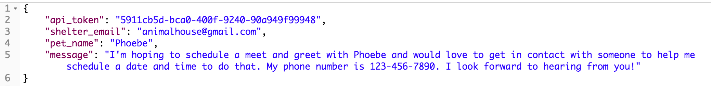
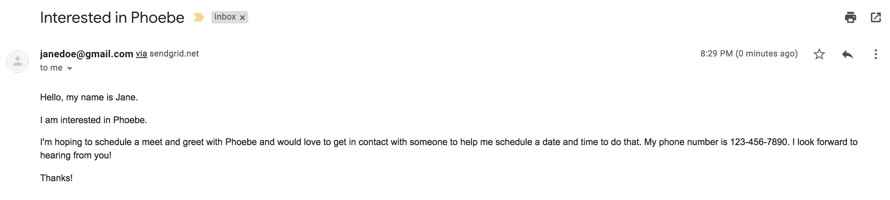
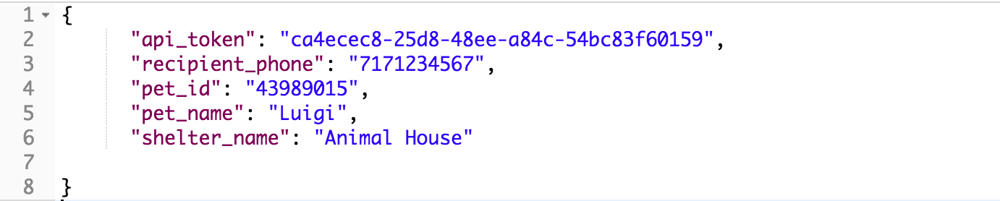
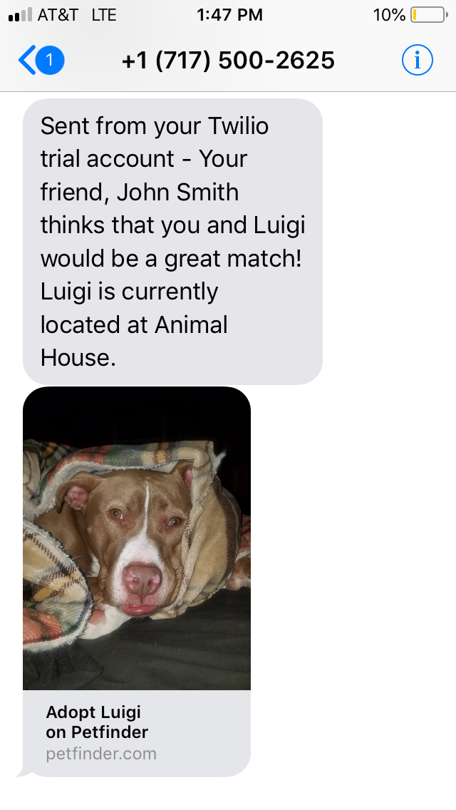
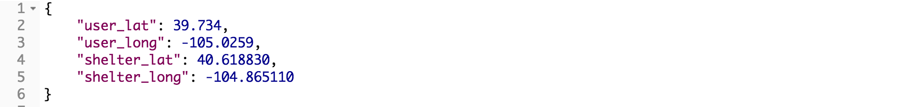
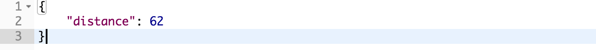

# README

<h1>Adoptr Backend API </h1>

<h3>Hosted on https://adoptr-be.herokuapp.com/ </h3>

This API is built to work with the Adoptr Frontend. The repo for the Adoptr Frontend can be found at https://github.com/colev1/cross-poll-fe. 

The endpoints that are available are as follows: 

<h2>post /api/v1/users</h2>
This post request registers a user on the app. Below, you can see the correct way to pass params through the body, as well as the responses that a user will get when registration is successful or not. 

Endpoint to Register a User: 

Correct Body to Register a User:

Response for a Successfull User Registration (users should extract and save the api for later requests during the session): 

Response for an Errored User Registration: 

Response for an invalid email address:

<ln>
  
  <h2>post /api/v1/sessions</h2>
This post request logs an existing user into the app and store their info in sessions. Below, you can see the correct body format for the request, as well as the two possible responses for a successfull and an errored log in. 

Endpoint to Login a User:

Correct Body to Log in a User:

Response for a Successfull User Log In (users should extract and save the api for later requests during the session): 

Response for an Errored User Log In: 

<ln>
  
  <h2>get /api/v1/locations</h2>
  
  To get a users zip code, make a get request to /api/v1/locations. 
  The response will return just the zip code where the user is located, as well as the users latitude and longitude. It will look as follows: 
  
  
  
  Lat and long should be saved in local storage for future requests. 

<ln>
  
  <h2>get /api/v1/favorites</h2>
 To get all of the favorites that a user has saved, make a get request to api/v1/favorites and either put the api_token in the body like this: 
 
 
 
Or send the request with api_token as a query param such as 
<h2> api/v1/favorites?api_token=${whateverTheApiTokenIs} </h2>
(Using params will work better than putting it through the body on this get request). 
 
 If a user does not have any favorites saved, and the get request is called, the response will look as follows: 
 
 

 If there are saved favorites for the user, the response will look as follows: 
 
 
 
 
 <ln>
  
  <h2>post /api/v1/favorites</h2>
  
  To save a favorite to a user, send a post request to /api/v1/favorites and provide the following in the body of the request:
  
  
  
  After sending this post request, a successfull post will return the following: 
  
  
  
  If the request does not return properly, it is because the api_token is not associated with a user, and there will be an error message that will say this. 
  
  
   <ln>
  
  <h2>delete /api/v1/favorites</h2>
  
  To delete a favorite that the user had saved, send a delete request to /api/v1/favorites and provide the following in the body of the request: 
  
  
  
  Right now, the response for a successful request gives back an updated list of that users favorites, but we can change this to a success message in the future. 
  
  
  
   <ln>
  
  <h2>post /api/v1/shelter_notifier</h2>
  To send an email to a shelter, send a post request to api/v1/shelter_notifier with the following in the body: 
  
  
  
  This request will send an email to the shelter's email address in the following format: 
  
  
  
  
  
     <ln>
  
  <h2>post /api/v1/texts</h2>
  
  This endpoint allows a user to send a text message to a friend regarding an animal they found. The response should look as follows, where the pet_id is the id for the pet from petfinder, and the recipient_phone, is the number of a friend that the user wishes to send the animal to. Right now, the phone number should be inputed without any dashes or parantheses... just the numbers. 
  
  
  
  Right now, we are using a twilio trial, so only certain numbers (Meg's, Geoff's, and Cole's) are verified. We can look into buying a number from twilio (2 bucks a month) to avoid this limitation. 
  
The text will appear as follows, with a link to the dog's profile included at the bottom of the message: 
  
    
   
 <ln>
  
  <h2>get /api/v1/distances</h2>
    
  This endpoint will allow our front end to populate the distance a user is from the shelter using the stored lat/long from the user as well as the shelters lat and long. 
  
  The request should look like this: 
  
    
   
  And the response will simply be the mileage: 
  
    
  

<h1>Set Up</h1>

Clone this repository and perform the following instructions in your terminal:

1. git clone <github repo link>
2. cd cross-poll-be
 
<h2>Versions</h2>
Adoptr API was developed using Rails 5.2 and Ruby 2.4

<h2>Keys/Tokens Needed </h2>
Kickbox API: https://kickbox.com/
IPstack API: https://ipstack.com/documentation
Sendgrid: https://sendgrid.com/
Twilio: https://www.twilio.com/

Gem Install Figaro in your terminal and include the following documentation in your application.yml file: 

IPSTACK_API_KEY: "key_goes_here"
KICKBOX_API: "key_goes_here"
TWILIO_ACCOUNT_SID: "sid_goes_here"
TWILIO_AUTH_TOKEN: "token_goes_here"
TWILIO_PHONE_NUMBER: 'phone_num_goes_here' <--- must be in single quotes

<h2>Install</h2>
1. bundle install
2. rake db:{drop,migrate} 
3. rails s (opens server)
4. visit http://localhost:3000 to access api endpoints locally

<h2> Testing </h2>
run 'rspec' in terminal to check testing coverage

<h2>Built With</h2>
Rails
Google API
RSpec
ShouldaMatchers
Capybara
Launchy
SimpleCov
BCrypt
PostreSQL
Figaro

<h2>Author</h2>
Meghan Stang (mstang15)
Geoff Adebonojo (geoffreyadebonojo)
